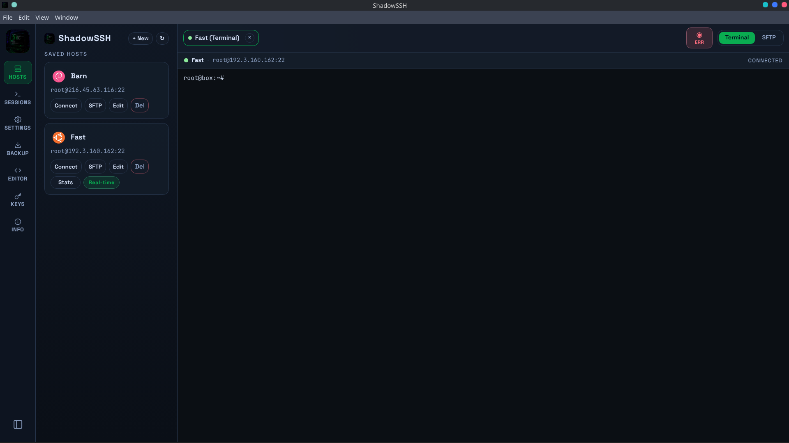
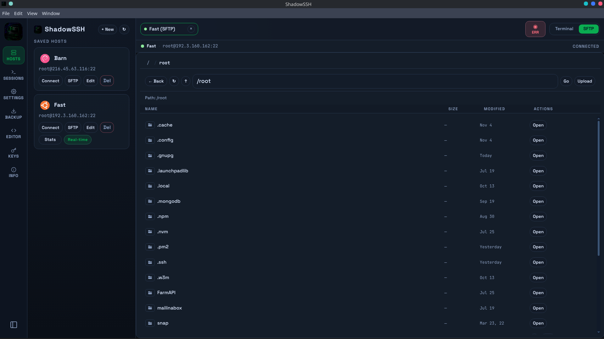

<p align="center">
  
</p>

<h1 align="center">ShadowSSH</h1>

<p align="center">
  A fast, modern desktop SSH client with multi-tab sessions, SFTP, key management, and more.
</p>

<p align="center">
  
  
  
  
  
</p>

---

## Screenshots

<p align="center">
  
  
</p>

---

## Features

### Terminal
- **Multi-tab SSH sessions** — open unlimited connections simultaneously, each with its own tab and status indicator
- **Full xterm.js terminal** — true color support, scrollback buffer, keyboard shortcuts
- **8 terminal themes** — Oceanic, Matrix, Amber, Nord, Dracula, Solarized, Green, White

### File Management
- **SFTP browser** — navigate, upload, download, rename, delete remote files without leaving the app
- **Configurable start path** — set a default SFTP directory per host

### Host & Key Management
- **Host manager** — save hosts with labels, OS icons, auth settings, and jump server config
- **20+ distro icons** — automatic OS detection with matching icons (Ubuntu, Arch, Kali, Debian, and more)
- **SSH key generation** — generate Ed25519 / RSA keys directly in the app
- **Jump host / proxy** — connect through a bastion server with full credential support

### Productivity
- **Config file editor** — edit remote config files in-app
- **Live connection monitor** — see all active sessions and their state at a glance
- **Backup & restore** — export your saved hosts to a file and re-import on any machine
- **Auto updates** — checks for new releases automatically via GitHub

### Appearance
- **3 UI themes** — Dark, Light, and Onyx
- **Customizable font size & font family** — tweak the terminal to your preference

---

## Download

Grab the latest release from the [Releases](https://github.com/ismdevx/ShadowSSH/releases) page.

| Platform | Package | Status |
|----------|---------|--------|
| Linux    | `.deb` · `.AppImage` | ✅ Available |
| Windows  | `.exe` (NSIS) | ⚠️ Under development |
| macOS    | `.dmg` | Coming soon |

---

## Install

### Debian / Ubuntu / Kali / Mint
```bash
sudo dpkg -i shadowssh_1.0.0_amd64.deb
```

### AppImage
```bash
chmod +x ShadowSSH-1.0.0.AppImage
./ShadowSSH-1.0.0.AppImage
```

---

## Build from Source

**Requirements:** Node.js 20+, npm

```bash
git clone https://github.com/ismdevx/ShadowSSH.git
cd ShadowSSH
npm install
```

| Command | Description |
|---------|-------------|
| `npm run dev` | Start in development mode (hot-reload) |
| `npm run dist` | Build Linux packages (`.deb` + `.AppImage`) |
| `npm run dist:mac` | Build macOS `.dmg` |

Output goes to `dist-packages/`.

---

## Tech Stack

| Layer | Technology |
|-------|-----------|
| Runtime | Electron 41 |
| UI | React 19 + TypeScript |
| Terminal | xterm.js 6 |
| Styling | Tailwind CSS 4 |
| SSH | ssh2 |
| Storage | electron-store |
| Updates | electron-updater |
| Bundler | Vite 8 |

---

## License

MIT © [ismdevx](https://github.com/ismdevx)

